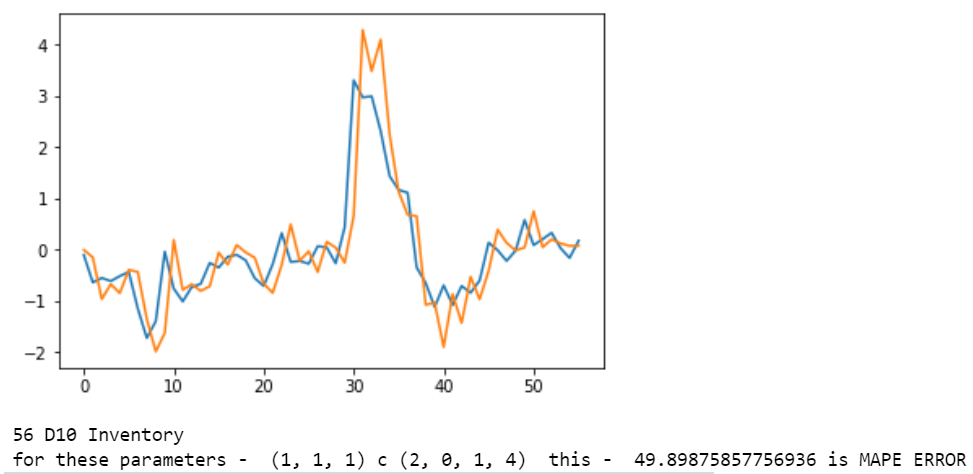

#### Project Title

# Willow Cash Flow Prediction Challenge - Discovery (July-2020)


### Challenge Overview
The goal of this challenge is to forecast Working Capital which is made up of :

- Inventory
- Receivables
- Payables and Accruals
- Returns and Rebates
These elements are forecasted at market-level and then rolled up to region. 

Additionally, the following are provided as there is expected to be some relationship between these and the working capital elements.

- Net Sales: The Net Sales is expected to be related to Receivables and "Returns and Rebates"
- Gross Profit: The Cost of Sales (Difference between Net Sales and Gross Profit) is expected to be related to Inventory and "Payables and Accruals"
- Advertising and Promotions: The A&P is expected to be related to "Payables and Accruals"
- Operating Profit: The difference between Gross Profit and Operating Profit, and then removing A&P, is "Other Expenses". It is expected that "Other Expenses" is related to "Payables and Accruals", although this relationship will be different from that of A&P above.

Note that the above ones are cumulative each year. 

## Project structure
├── data\
│   ├── empty_test_sheet.csv\
│   ├── Parameters_complete.csv\
│   ├── test_sheet.csv\
│   └── training_data.csv\
├── main.ipynb\
├── images\
├── Report\
├── submissions\
├── requirements.txt\
└── License

### Prerequisites

```bash
pip install -r requirements.txt
```



### Summary
- AutoRegressive Models
- Time-Series
- MAPE (Mean Absolute Percentage Error)
- AutoCorrelation
- Stationary Models
- Big Data
